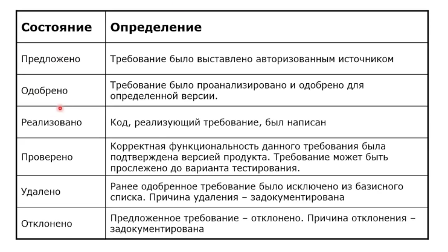
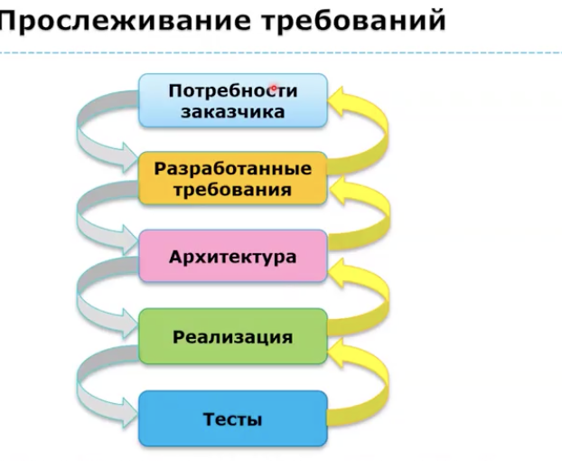
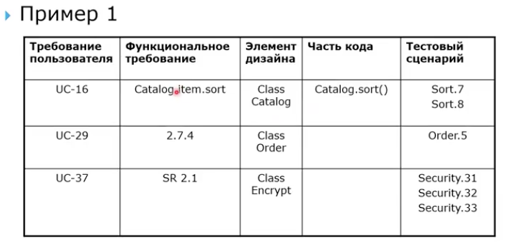
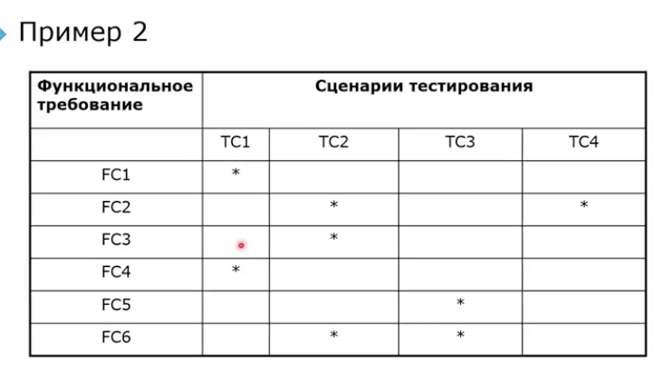

# Требования
## Изменения требования
### Причины изменения требований

- заказчик
    - не понравилось после просмотра
    - передумал
    - забыл

- рынок 
    - такой продукт уже не продать
    - нужно выйти на рынок прямо сейчас, иначе продукт не продать

- разработка
    - неточное определение границ проекта
    - требования плохо определены
    - требования не были поняты или были поняты неправильно
    - сработали архитектурные риски

### Условия возможности изменения требований
- водопадные стратегии - практически никогда
- инкрементные - возможно с ограничениями 
- эволюционные - возможно

### Политика управления изменениями 
- должен быть принят процесс контроля за изменениями 

- все изменения должны следовать процессу или не рассматриваться 

- для неутвержденных требования не выполняется никаких действий, кроме исследования осуществимости
- все запросы на изменения должны быть одобрены советом по управлению изменениями 

- содержание запроса на изменение должно быть доступно всем заинтересованным лицам проекта

- начальный текст запроса должен быть неизменным 

- анализ воздействия должен проводиться для каждого изменения 
- каждое одобренное изменение должно прослеживаться до запроса на изменения
- обоснование каждого одобрения на изменение должно быть задокументировано

## Анализ влияния изменения 

- выявление последствий внесения изменений 

- определение всех артефактов, которые нуждаются в модификации, если изменение будет принято 

- определение задач, необходимых для реализации

- оценка усилий для завершения этих задач

- оценка нахождения этих задач на критическом пути проекта

- оценка влияния изменения на график работ 
- оценка влияния на стоимость 
- оценка приоритета изменения, учитывая:
    - достоинства
    - недостатки
    - затраты
    - риски

### Варианты решения на запрос изменений требований
- согласие 
    - с изменением сровков работ 
    - без изменения сроков работ

- отказ 
    - мотивацию отказа документируем

## Управление версиями требований
- требования могут устаревать
- требования могут быть противоречивы
- контроль версий документов

- контроль версий требований
    - создание начальных версий требований
    - ведение истории изменений 
    - авторизованный доступ к измененийм требований

## Состояния требований

## Отслеживание состояний требований 

- показатель прогресса проекта
- используется при анализе изменений
- обосновывает некоторые решения, принятые во время разработки

- обычно измеряется в процентах завершенности работ

## Прослеживание требований 

### Матрица прослеживаний требований

 

