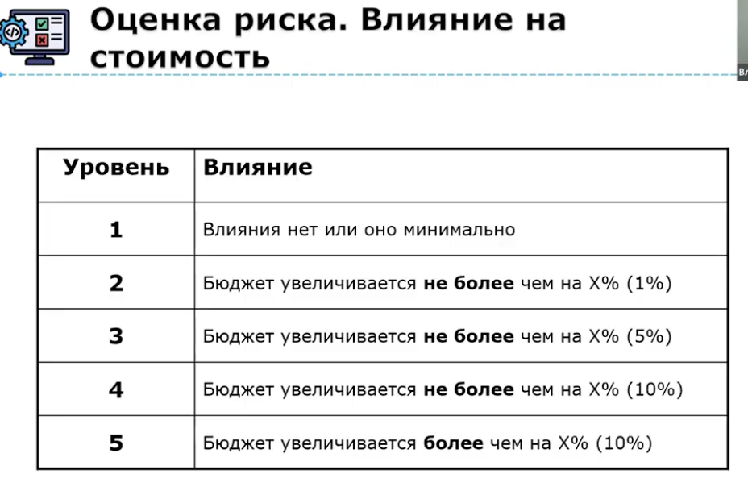
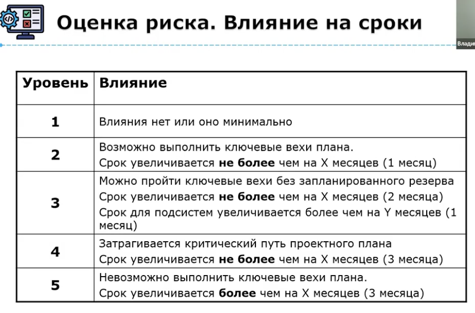
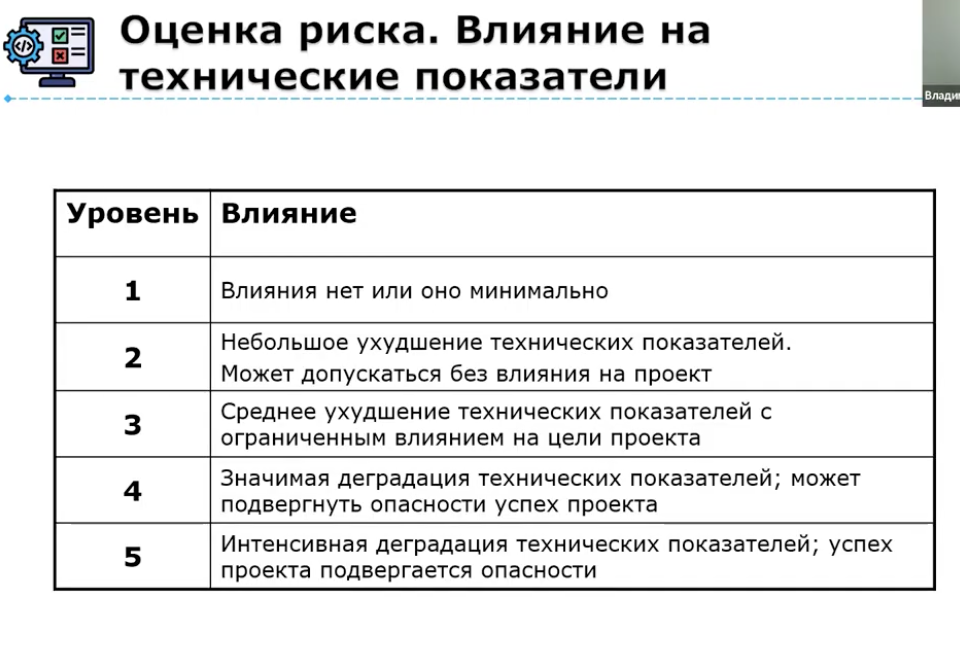
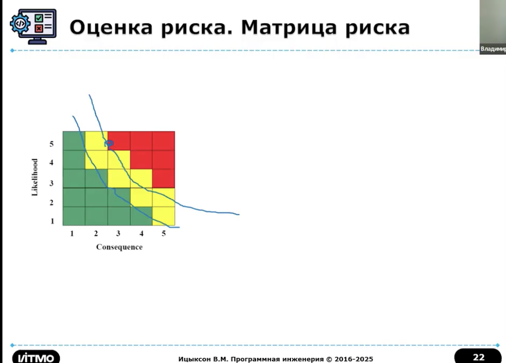
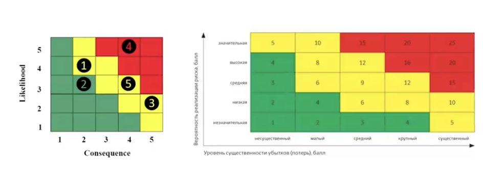

# Риски

## Идентификация рисков 

- формирование первичного списка элементов риска данного проекта

- Категории рисков
    - проектные риски 
    - кадровые 
    - технические
    - организационные 
    - процессные
    - риски, связанные с поддержкой и эксплуатацией
    - внешние риски

### Проектные риски
- ошибки планирования (этапы и ресурсы)
- недостаток ресурсов
- некорректная оценка времени и затрат 
- низкая производительность команды
    - проблемы с мотивацией
    - проблемы со своевременным обучением
    - плохая организацией работы команды

### Кадровые риски
- нехватка навыков/опыта
- потери ключевых сотрудников
- конфликты внутри команды 
    - технические разногласия
    - личностные конфликты

### Технические риски
- неправильные требования
    - неполные, неточные
    - постоянные изменения в требованиях

- нереалистичные цели
- новые технологии
- техническая сложность 

### Организационные риски

- отсутствие поддержки руководства
    - слабая или отсутствующая поддержка проекта со стороны руководства

- сложности коммуникации 

- культура организации
    - культурные аспекты организации, препятствующие успешному выполнению проекта

### Процессные риски
- недостаточные процессы
    - отсутствие процессов разработки и управления проектом
    - недостаточная формализация процессов

- плохое управление конфигурацией

- недостаточное тестирование

### Риски связанные с поддержкой и эксплуатацией

- поддержка пользователей

- обслуживание и обновление

### Внешние риски
- изменения на рынке

- зависимость от заказчиков 
    - возможность прекращения финансирования

- зависимость от смежников 
    - проблемы с поставщиками оборудования
    - проблемы с поставщиками ПО

- правовые и регуляторные риски

## Анализ риска
оценка вероятности возникновения каждого типа рисков и величины потерь

- вероятность определяется на основе экспертных оценок и статистики

- все риски заносятся в таблицу

## Ранжирование рисков
- сортировка рисков, пропорционально влиянию
- 20% элементов риска - обысно составляют 80% суммарного проектного риска

### Планирование управления риском 
- цель - свормировать набор функций управления каждым элементом риска
- выбирают эталонные уровни риска - такие которые могут быт причиной прекращения проекта
    - превышение стоимости
    - срав планирования
    - деградация технических показателей

- имеются оценки уровней влияния риска на бюджет, сроки и технические показатели
- необходимо определить суммарный уровень влияния на показатели
- самый частый вариант - уровень выбирается в соответствии с максимальной оценкой влияния на конкретный показатель

### Матрица риска

- строятся зависимости между элементом риска и эталонными уровнями риска
- строится план управления каждым элементом риска
- план интегрируется в общий план развития проекта

### Разрешение и наблюдение риска
- разрешение - плановое применения действия по уменьшению риска 
- наблюдение 
    - цикличность
    - корректировка

### Методика управления рисками № 2

- выполняем выделение и ранжирование наиболее существенных элементов риска

- производится планирование регулярных просмотров процесса разработки

- при просмотре рассматриваются 10 верхних элементов риска
    - фикс приоритет каждого из 10
    - фиксируется предыдущий приоритет 
    - частота попадания в верхнюю часть списка
    - обсуждается прогресс в разрешении риска

### Стандарты управления рисками
- есть
