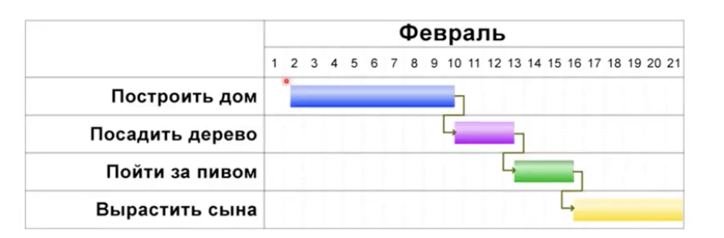
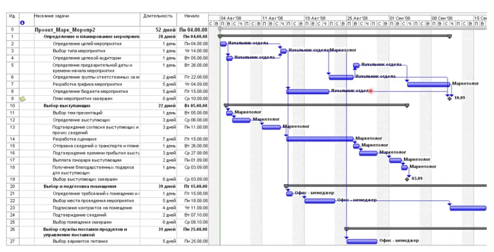
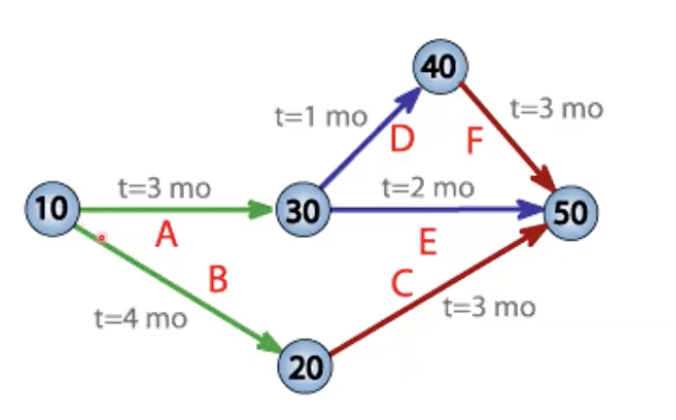
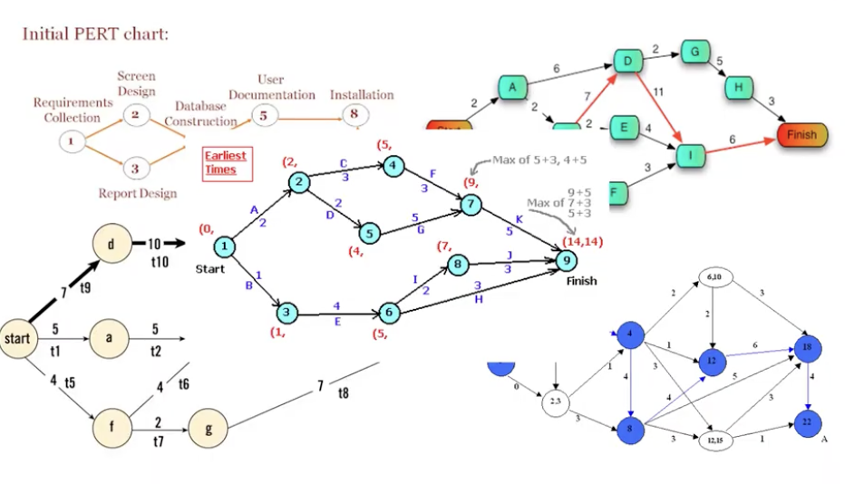

# Визуализаця программных проектов. Наблюдение за программными проектами

## Визуализация плана

- визуализация - основной способ планирования, контроля и наблюдения

- для классических (не agile) методологий существуют два подхода 
    - диаграммы ганта (1910г)

    

    

    - диаграммы PERT (Program Evaluation and Review Technique) (другие названия - сетевой график, сетевой план-график)

    

    - задачи - дуги
    - кружочки - этапы программного обеспечения

    - строгая математическая модель (отсутсвие циклов, найти самый длинный путь - это будет критический путь - путь самой большой длинны, который собой определяет время выполнения проекта.)

    - нет удобной временной шкалы - делают гибрид перта и ганта - проекция на ось
    

## Наблюдение за проектом

- наблюдение за проектом - процесс контроля хода выполнения проекта на основе анализа артефактов проекта

- Активности 
    - задачи, дефекты, фиксации изменений

- ресурсы
    - сотрудники, оборудование

- временные сущности
    - этапы, вехи, критический путь

- виды срезов
    - задачи, сотрудники, вехи, дефекты, фиксации изменений, коммиты, крит путь

### Вехи
- веха - milestone (милевой столб(понимать, как далеко ехать от манчестера до лондона и обратно), верстовой столб)

- позволяют оценить прогресс

- прохождение вехи можно наблюдать и контролировать 
- вехи - те контрольные точки, по которым можно грубо оценить успешность всего проекта

- в зависимости от способа организации проекта веха может быть 
    - видимой только менеджеру
    - менеджеру и заказчику

### Срез по задачам 

- сотрудники, занятые решением задачи

- соответсвие задач - графикам
- процент завершенности по задачам проекта
- общее количесво дефектов задач
- количество незакрытых дефектов задач 

### Срез по задачам 
- текущие задачи сотрудника 
- отставание от графика сотрудника
- общее количесво дефектов, относящихся к сотруднику
- количество незакрытых дефектов, относящихся к сотруднику

### Срез по дефектам

- количество дефектов для каждой задачи
- количество незакрытых дефектов для каждой задачи
- история изменения дефектов
- среднее время исправления дефектов
- среднее количество дефектов у сотрудников
- распределение дефектов по сотрудникам

### Срез по фиксациям изменений

- срез по фиксациям изменений (коммитам)

- среднее число коммитов на сотрудника за единицу времени
- равномерность коммитов сотрудника

### Срез по крит пути
- сотрудники в крит пути

- задачи в крит пути

- временные задачи в крит пути

