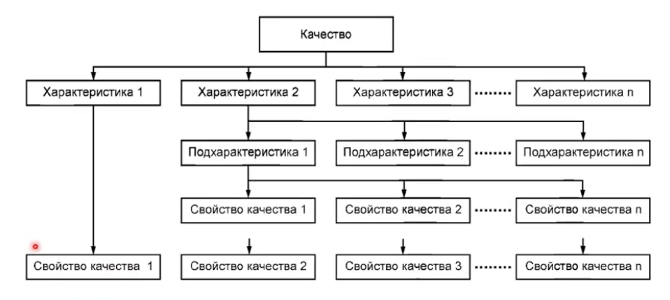
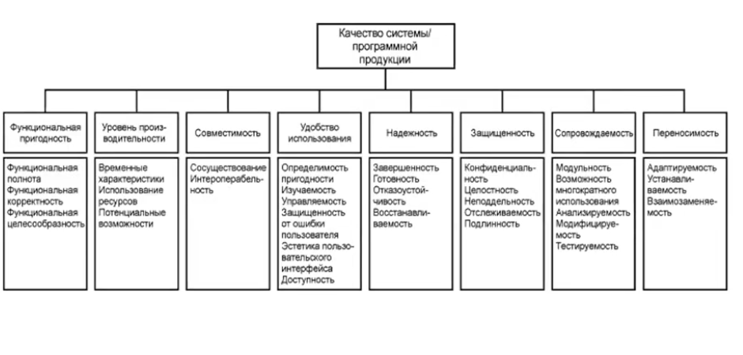
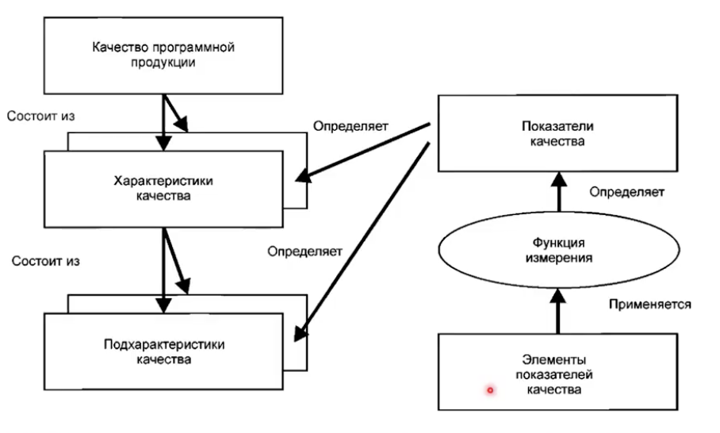

# Качество программного обеспечения 

## Тренды в разработке ПО

- объем программ растет очень быстро

- время разработки новых версий ПО сокращается

- всё больше задач решается программно

- ПО всё больше используется при решении критически важных задач

- существенная часть ПО является свободной и поставляется as is 

- ИИ

## Известные примеры программных ошибок

- гибель несущего аппарата Маринер-1

    - сша
    - 1962
    - гибель аппарата и ущерб 18,5 млн
    - ошибка в одном символе

- ускоритель Therac-25
    - сша
    - 1987
    - переоблучение пациентов онкоклиник
    - причина: race condition

- сбой в работе телефонной сети AT&T

    - сша
    - 1990
    - 75 миллионов звонков остались без ответа
    - причина: плохо протестированое обновление

- сбой в работе противоракетного комплекса Patriot
    - сша/израиль
    - 1991
    - погибло 28 человек, 100 ранено
    - причина: ошибка округления

- Авария при запуске ракеты Ариан-5

    - европа
    - 1996 год
    - взрыв ракеты после старта, $7млрд

- Потеря спутника Mars Climate Orbiter

    - сша
    - 1998 год
    - падение спутника и ущерб $125 млн

    - отсутствие преобразования английских единиц измерения в метрическую систему

- сбой навигационной системы f16

    - израиль, мертвое море
    - 1990 годы
    - высотомер выдавал значение меньшее или равное нулю, автопилот пытался перевернуть самолет

    - причина: отсутсвие в коде модуля обработки ситуации, когда высота нулевая или отрицательная

- Некорректная работа мазагина Amazon
    - 1990 годы
    -  при заказе отрицательногокол-ва деньги зачислялись 

- остановка доменной печи 
    - нидерланды 
    - 29 февраля 2000 года

## Что такое качественное ПО?

### Стандарты качества ПО

    - международные стандарты (важно SQuaRE)
    - российские стандарты (важно: ГОСТ: Информационные технологии. Системная и программная инженерия. Требования и оценка качества систем и программного обеспечения (SQuaRE). Модели качества систем и программных продуктов)

### Качество системы

- качество системы - это степень удовлетворения системой заявленных и подразумеваемых потребностей различных заинтересованных сторон

### Характеристики качества

- функциональная пригодность
    - степень, в которой продукт или система обеспечивают выполнение функции в соответсвии с заявленными и подразумеваемыми потребностями или использовании в указанных условиях

    - подхарактеристики 
        - функциональная полнота
        - функциональная корректность
        - функциональная целесообразность
- уровень производительность

    - производительность относительно использованных при определенных условиях ресурсов
    - подхарактеристики 
        - временные характеристики
        - использование ресурсов

        - потенциальные возможности (максимальные характеристики)
- совместимость 
    - способность обмениваться информацией с другими продуктами, системами или компонентами, и/или выполнять требуемые функции при совместном использовании одних и тех же аппаратных средств или программной среды
    - подхарактеристики 
        - сосуществование
        - функциональная совместимость (способность двух подсистем обмениваться информацией)

- удобство использования 

    - степень, в которой продукт или системы могут быть использован определенными пользователями для достижения конкретных целей с эффективностью, результативностью и удовлетворенностью в заданном контексте использования

    - подхарактеристики 
        - определимость пригодности
        - изучаемость
        - управляемость
        - защищенность от ошибки пользователя
        - эстетика пользовательского интерфейса
        - доступность
- надежность 
    - степень выполнения системой, продуктом или компонентом определенных функций при указанных условиях в течении установленного периода времени 
    - подхарактеристики 
        - завершенность 
        - готовность

        - отказоустойчивость (работать даже если происходит сбой)
        - восстанавливаемость
- защищенность 
    - подхарактеристики
        - конфиденциальность 
        - целостность 
        - неподдельность 
        - отслеживаемость 
        - подлинность
- сопровождаемость 
    - результативность и эффективность, с которыми продукт или система могут быть модифицированы предполагаемыми специалистами по обслуживанию 
    - подхарактеристики 
        - модульность 
        - возможность многократного использования

        - анализируемость 

        - модифицируемость 

        - тестируемость

- переносимость 
    - степень простоты эфективного и рационального переноса система продукта или компонента из одной среды в другу
    - подхарактеристики
        - адаптируемость 
        - устанавливаемость
        - взаимозаменяемость 

    