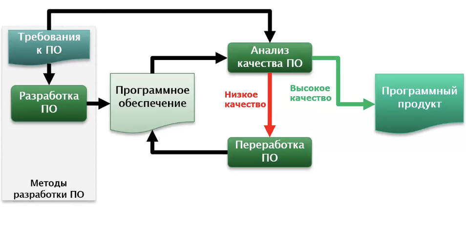
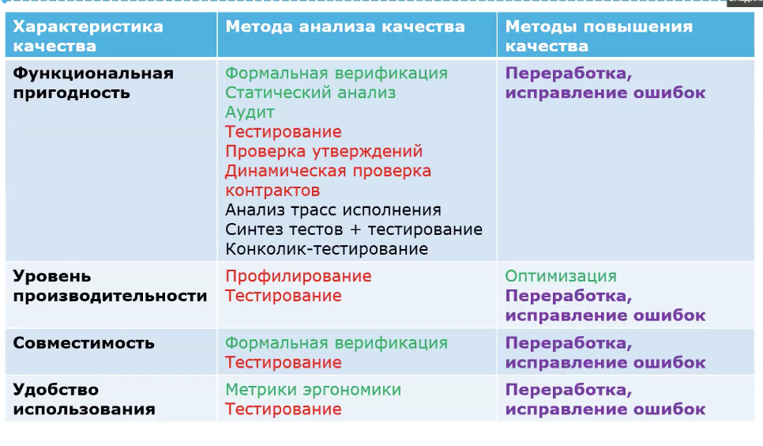
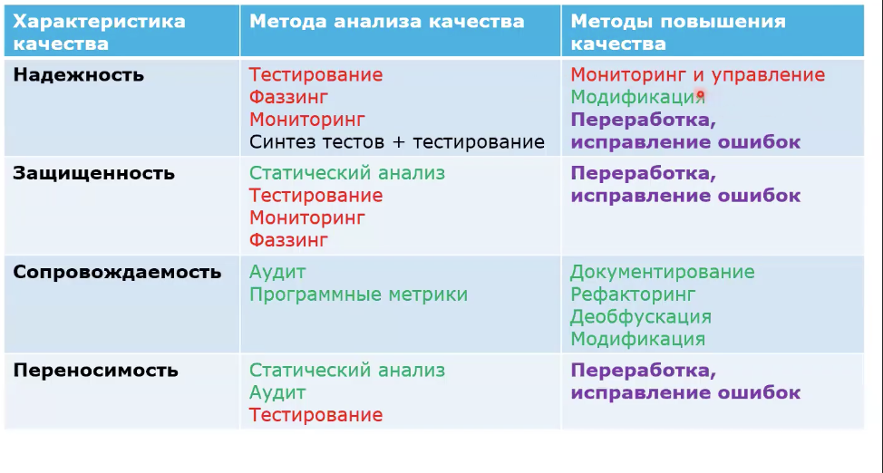

# Качество

### Заинтересованные лица

- пользователи/заказчики
    - функциональная пригодность 
    - надежность 
    - удобство использования 
    - уровень производительности
    - защищенность 

- разработчики/руководители/группы поддержки
    - совместимость 
    - сопровождаемость 
    - переносимость

### Задачи обеспечения качества ПО

- оценка качества ПО
- проверка соответствия программы спецификации
- проверка соответствия программы пожеланиям заказчика
- обнаружение программных ошибок
- проверка выполнимости свойств программы

# Методы обеспечения качества ПО

- улучшать существующее ПО
- сразу проектировать качественное ПО

## Обеспечение качества существующего ПО

### классификации методов

- по используемым формализмам (формальные/неформальные)

- по необходимости запуска анализируемой программы
    - динамические
    - статические 
    - смешанны

- по уровню автоматизации
    - ручные
    - автоматизированные
    - автоматический

### Используемые формализмы

- формальные методы
    - существуют строгии формальные модели метода обеспечения качества 
    - процедура строга формализована

- неформальные методы
    - строгие формальные модели отсутствуеют или не используются 
    - процедура не формальная
    - примеры: аудит, ручное тестирование

### Необходимость запуска анализируемой программы

- динамические 
    - при реализации метода исследуемая программа запускается на выполнение 
    - характеристики качества ПО анализируются во время запуска

    - примеры: тестирование, профилирование

- статические методы
    - исследуются только статические артефакты: код, модели, спецификации, документация
    - программа не запускается
    - примеры: code review, статический анализ, формальная верификация

- смешанные 
    - примеры: анализ трасс исполнения, генерация тестов + тестирование

### Уровень автоматизации

- ручные 
    - большая часть операций производится вручную 
    - пример: ручное тестирование

- автоматические методы:
    - все операции автоматизированы 
    - человек не требуется
    - ci

- автоматизированные методы: 
    - только часть операций автоматизирована
    - требуется участие человека
    - пример: статический анализ

### Динамические методы анализа качества

- тестирование 
    - очень просто реализуется 
    - не позволяет быть увереным, что в программе нет ошибок

- Фаззинг 
    - подаем случайные данные, смотрим чтобы программа не упала

    - вид тестирование, при котором программу пытаются вывести из строя с помощью подачи на вход случайных данных 

- профилирование
    - оценить в динамике характеристик производительности программ

- Мониторинг
    - проверка свойств программы извне во время их исполнения с помощью специализированных контролирующих программ 

- Проверка контрольных точек программы
    - проверки утверждения (assertion)
    - динамическая проверка контрактов

### Статические методы анализа качества

- формальная верификация 
    - подтверждение, что программа соответствует спецификации
    - проверка того, что определенные свойства в программе выполняются
    - методы:
        - дедуктивная верификация (доказательная, дедукция)
        - Model checking(превращаем программу в семество конечных автоматов)

- статический анализ   
    - анализ различных программных артефактов
    - проверяют неявные спецификацие предъяляемые ко всем программая

- аудит (code review)

- вычисление и анализ программных метрик

### Смешанные методы анализа качества

- анализ трасс исполнения 
    - инструментирование программы (встраивание в программу логгеров)
    - сбор данных о состоянии программы (в динамике)
    - анализ протокола (в статике)

- синтез тестов + тестирование 
    - статический синтез 
    - запуск синтезированных тестов

- конколик-тестировани

### Методы повышения качества ПО

- статические методы
    - трансформация программ
        - рефакторинг
        - оптимизация
        - автоматическая модификация кода (защитный код - например, обработка ошибок)
        - деобфускация кода
        - переработка ПО (исправление ошибок)
    - документирование

- динамические 
    - мониторинг и управление 

