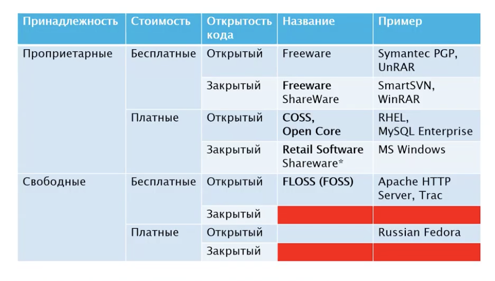

# Лицензии

## Классификации программного обеспечения

- по отношению к собственности 
    - проприетарное ПО
    - свободоне ПО

- По отношению к извлекаемой прибыли
    - коммерческая ПО
    - бесплатное ПО

- По доступности исходных кодов 
    - открытое ПО
    - ПО с закрытым исходным кодом

### По отношению к собственности 
- свободное    
    - права пользователя по свободной установке, запуску, использованию,
    изучению, распространению и модификации защищены юридически с помощью свободных лицензий

    - Ричард Столлман: 4 свободы ПО
        - 0: свобода запуска с любой целью
        - 1: свобода изучения работы программы и адаптация её к своим целям
        - 2: свобода распространения копий
        - 3: свобода улучшения программы и публикации улучшений так, что всё общество выиграет 

- проприетарное ПО
    - является собственностью авторов или правообладателей
    - не удовлетворяет критериям свободного по

### По отношению к извлекаемой прибыли

- коммерческое
- бесплатное

### По доступности исходных кодов

- открытое ПО
    - исходные коды доступны в комплекте поставки
    - доступно по запросу

- с закрытыми исходными кодами

**запрещенные комбинации** - свободное по не может быть с закрытыми исходными кодами

всего комбинаций 6!!

## Лицензии свободного ПО

### GNU General Public Licence (GPL)

- первая версия 1991 год
- третья версия 2007 (пользуемся сейчас)

- основная цель: предоставить пользователю права по отношению к ПО:
    - копирование 
    - модификация
    - распространение (в том числе коммерческое)

- принцип наследования прав copyleft - защищает права пользователя

- распространитель ПО на условиях GPL обязан предоставить получателю возможность доступа к исходным кодам

- регламентирует:
    - право на копирование и распространение
    - право на изменение 
    - предоставление исходного кода
    - запрет дополнительных ограничений при дальнейшем распространении (если взяли продукт с лицензией GPL и видоизменили, то дальше рааспространять можно только тоже только с лицензией GPL)

- GPLv2 
    - дополнительно к GPLv1
    - свобода или смерть - превалирование над внешними ограничениями. Если нельзя выполнить все условия GPLv2, то распространять вообще нельзя

    - только на англе
- GPLv3
    - 2007 год
    - дополнительно ко второй версии:
        - защита пользователей от судебных претензий при обходе технических средств защиты
        - запрещает тивоизацию: органичение аппаратного обеспечения на изменение ПО (должен быть механизм обновления)

### GNU Lesser General Public License (LGPL)
- стандартная общественная лицензия ограниченного применения GNU

- является компромиссом между GPL и лицензиями типа BSD, MIT

- 1991 год

- используется в основном для библиотек

- регламентирует линковку библиотек с другим ПО, распространяемым по другим лицензиям

- права copyleft на библиотеку, но не накладывает на линкуемое ПО

- начиная с версии 2.1 
    - необходимость наличия механизмов использования последней версии библиотеки, распространяемой под LGPL
        - неявный намек на динамическое связывание (?)

### Apache Licence

- версия 1 - 2000
- версия 2 - 2004
- является лицензией на свободное ПО
- несовместима с GPLv2 
- совместима с GPLv3 (в одну сторону)

- позволяет объединяться с кодом, распространяемым под другой лицензией
- не является copyleft - в поставляемом ПО права могут изменяться

- основные условия 
    - информирование о факте использования исходного кода, лицензированного под лицензией Apache
    - сохранение названия ПО

### BSD

- из berkley
- в 1983 году
- лицензия на свободное ПО
- совместима с GPL
- код может меняться без ограничений
- не обеспечивает copyleft
- позволяет объединяться с кодом, рапространяемым под другой лицензией
- допускает проприетарное и коммерческое использование ПО

### Mozilla Public Licence (MPL)

- разработана Mozilla Foundation
- действующая версия - 2.0, 2012 год
- слабые copyleft 
    - исходный код,измененный под лицензией MPL, должен быть лицензирован по MPL

- допускает объединение с проприетарными продуктами
- рекомендуется использовать совместно с другими лицензиями

### MIT

- 1988 год
- разрешительная лицензия - позволяет использовать лицензируемый код в закрытом ПО при условии, что текст лицензии предоставляется вместе с этим ПО
- не copyleft
- совместима с GPL 
- второе название - x11 Licence