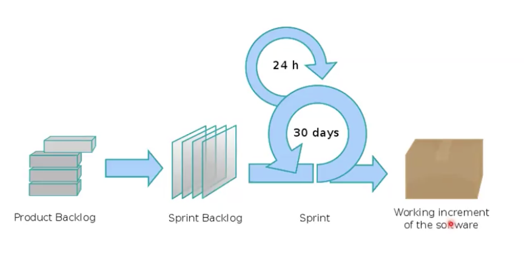
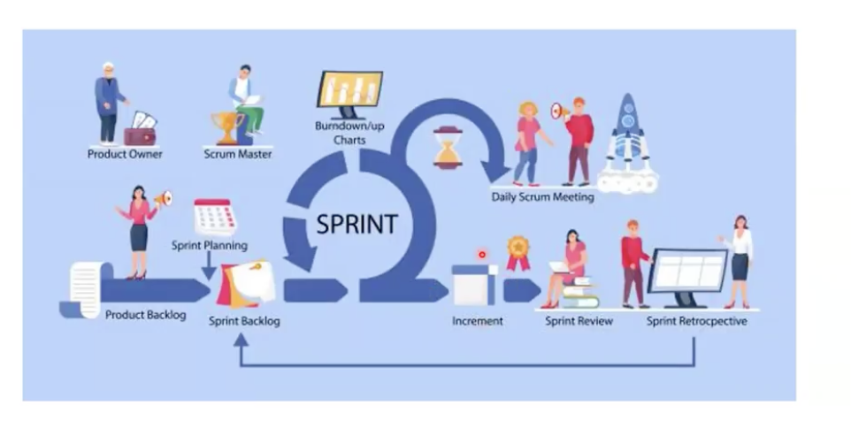
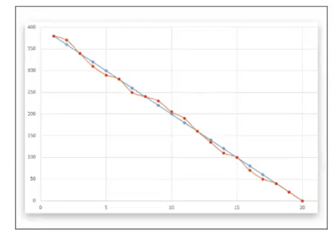
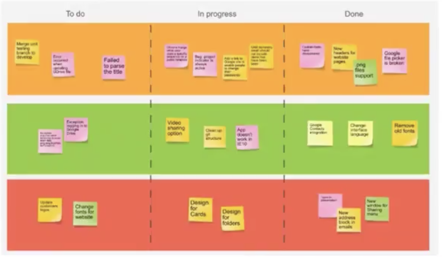
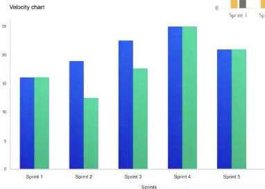

# Методология Scrum

- одна из самых популярных гибких методологий

- базируется на нескольких работах японских ученых, посвященных управлению хаусов

- предложена в 1995 году
- Авторы: Кен Швабер и Джеф Сазерленд

- Scrum - схватка в переводе
- итерационный процесс
- применима к любым этапам и особенностям разработки (в основном разработка и тестирование)
- хорошо стыкуется с использованием объектно ориентированного подхода

### Артефакты
- backlog: 
    - журнал пожеланий проекта
    - список работ, необходимых к выполнению

- sprint backlog
    - журнал пожеланий спринта

- инкремент 
    - объединенная реализация элементов Sprint Backlog (версия)

### Роли
- основные 
    - владелец продукта
        - отвечает за backlog
    - scrum master
        - владелец процесса
        - отвечает за эффективную работу команды
    - Разработчики
        - отвечают за реализацию задач из Sprint Backlog

- остальные 
    - пользователи
    - представители заказчика
    - эксперты - консультанты

## Активности
- Спринт 
    - max месяц
- Планирование спринта (специальная встреча)
    - не более восьми часов
- Scrum 
    - ежедневная встреча команды
- Обзор спринта 
    - в конце спринта
    - демонстрация инкременты
    - обратная связь
    - не более 4-ых часов

- Ретроспектива
    - в конце спринта
    - внутреннее обсуждение результатов спринта и обзор спринта
    - не более трех часов

  

  

### Планирование проекта
    - заказчик определяет и переодически меняет функциональные требования
    - владелец расставляет приоритеты
    - формирует backlog проекта

- Формируются небольшие группы (1-6) человек, для реализации небольших частей проекта
- Формирование групп и распределение задач
    - Sprint backlog для каждой группы

### Планирование спринта

- происходит в начале спринта

- Определяется относительная трудоемкость задач
    используются story point (SP)

- SP - относительная мера сложности задач из бэклога

    - задачи в бэклоге отсортированы по приориту
    - самая простая - 1 sp
    - остальные оцениваются закрытым голосованием относительно первой (карточки)
    - обычно шкала чисел фибоначи
    - если оценки близкие - то фикс
    - если расходятся - итерационнное обновление

- Сложность спринта - сумма sp по всем задачам

## Выполнение спринта
- происходит группой автономно 
- руководство не влияет 

## Обзор спринта
 - по окончании спринта
 - встреча с руководителями и заказчиками
 - демонстрация инкремента
 - получение обратной связи

## Ретроспектива
- по окончании спринта
- встреча команды
- обсуждение результатов спринта и обзора спринта

## Scrum 
- каждая группа ежедневно выполняет обсуждения
- участвовать могут все, говорить только основные участники
- задача scrum-мастера - решать проблемы

начатый спринт не может быть прерван новыми задачами!!!
смена требований только между спринтами

в scrum нет менеджера в понимании менеджера проекта, ключевое, что не дает проекту развалиться - дейлики

спринты большого размера запрещены, так как эта система самоменеджмента перестает работать и появляется необходимость добавления настоящего менеджера

## Инструменты
- диаграмма сгорания задач

- scrum доска

    - фактически столбцов обычно больше

- velocity chart 
    - позволяет посмотреть на несколько спринтов сразу

