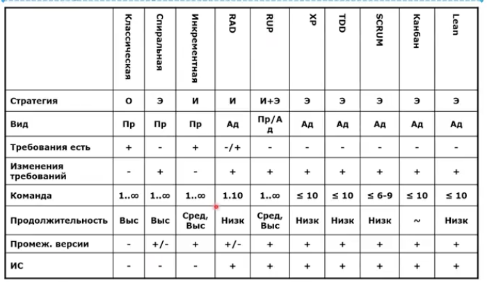

# Бережливая разработка приложений

- М. Поппендик, Т. Поппендик
- 2003 год

- минимизируем потери
- потери при разработке ПО
    - лишние функциональные возможности
    - Незавершенные работы
    - Ошибки
    - Ожидание (ждем когда кто то другой доделает что-то, от чего мы зависим)
    - передача
    - переключение задач
    - повторное обучение

## Принципы бережливой разработки
- исключение или уменьшение потерь
- постоянное обучение
- позднее принятие решений
- быстрая доставка заказчику
- мотивация команды
- интегрирование (целостная архитектура, понимание архитектуры заказчиком)
- целостное видение
(разделение разработчиками признаков бережливости, видение проекта как единое целое)

# ИТОГ
