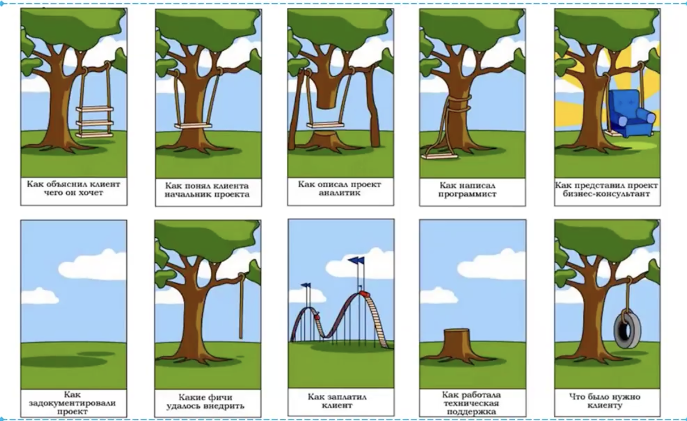

# Инженерия требований

- требования в основном очень не формализованный артефакт
- самая сложная задача
- влияние ошибок в сборе требований очень велико, их исправлять потом очень дорого

шуточная картинка

- разработка требований - самая сложная часть проектирования ПО
    - требования пользователей постоянно меняются
    - требования бывают неясны, двусмысленны, противоречивы, неполны
    - пользователи, представляющие требования могут быть недостаточно представительны
    - получаемые спецификации не достаточно детализированы
    - 

## Основные этапы, связанные с требованиями 

- определение требований
- свойства требований
- разработка требований (выявление и анализ)
- документирование
- планирование и управление

### Что такое требование

требование по IEEE 1990

- условие или возможность, необходимые пользователю для решения его задач или достижения цели

- условие или возможность, которым должна отвечать или которыми должна обладать система или ее компонента, чтобы удовлетворить контракт, стандарт, спецификацию или иной документ
- документированное представление условия или возможности, указанное в пунктах выше

### Свойства требований 

- корректность (правильно отражают )
- однозначность 
(формулировака требования подразумевает только одну трактовку)
- полнота 
(все пожелания заказчика нашли отражение в списке требований)
- непротиворечивость
(нет нескольких требований которые явно или не явно противоречат друг другу)
- приоритезация
(спецификация должна быть приоритезирована, каждому требования сопоставляется чисто - приоритет или класс (необходимые, условные, необязательные))
- проверяемость 
(если из формулировки требования можно проверить, выполнено оно или нет)
- модифицируемость 
(если они сформулированы так, что предполагают относительно простую их модификацию)
- отслеживаемость 
(если оно сформулировано таким образом, что по каждому требованию можно проследить связь с другими артефактами - документация, архитектура, куд, тесты...)
- единичность 
- атомарность (неделимость)
- актуальность
- выполнимость

## Виды требований
- функциональные 
    - бизнес-требования
    - пользовательские требования
    - функциональные
- нефункциональные
    - ограничения
    - требования к качеству

#### Функциональные требования
- Бизнес требования
    - формулируются заказчиками 
    - описывают цели, которые требуются достичь с данной системы
    - определяют назначение ПО

- Пользовательские требования
    - какие задачи можно решить с помощью системы
- Собственно функциональные требования
    - определяют функциональность

#### Нефункциональные требования
- как это должно быть сделано?

- характеристики качества:
    - надежность
    - совместимость
    - эффективность
    - гибкость
    - эргономике
    - безопасности

- ограничения 
    - ограничения на программные интерфеся, в том числе к внешним системам
    - требования.к применяемому оборудованию и ПО
    - соответсвия стандартам и правилам
    - требования к арх. решениям
    - бюджет
    - сроки

### Что не является требованиями? 
- детали архитектуры
- детали реализации
- сведения о планировании
- сведения о тестировании
- проектная информация 