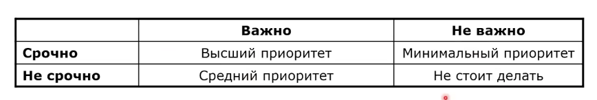

# Разработка требований 

- выявление (сбор) требований
- анализ требований

## Выявление требований
- Заинтересованные лица
    - заказчики
    - системные аналитики
    - менеджеры
    - пользователи
    - разработчики
    - служба поддержки
    - другие лица
заказчик не равно пользователь!

### Способы выявления требований

- семинары
- интервью 
- создание прототипов
- исследования
- фокус группа

#### Семинар
- открытое совместное обсуждение стоящих задач
- участники: заказчик (излагает имеющиеся требования, отвечает на вопросы) и исполнители (слушают, спрашивают, документируют)

составление спецификации требований - головная боль исполнителя

#### Интервью
- целенаправленный опрос-интервью
(помогает заказчику описать, что он хочет)
- исполнители
    - готовят спец. анкету
    - задают вопросы
    - ответы документируются
    - поясняем заказчику детали
- заказчик
    - отвечает на вопросы из анкеты

#### Прототипирование
- визуальное представление продукта для заказчика
- обсуждение стоящие высокоуровневых задач
- исполнители
    - создание прототипа
    - демонстрация
    - исправление
    - документирование
- заказчик
    - просмотр прототипа и корректировки

- применяется когда не все требования понятны
- позволяет быстро увидеть некоторые свойства продукта

#### Исследования 
- исполнитетли
    - получают от заказчика общее представление о продукте
    - исслежование рынка
    - анализ конкурирующих решений
    - документирование
    - согласование
- заказчик
    - представление  общей идеи
    - корректировка и утверждение

#### Фокус-группа
- выявляется группа пользователей
- группу подбирают исходя из ожидаемого портрета
- члены групыы все вместе или по отдельности участвуют в сборе требований
- отдельные требования компонуются в общий список требований

### Проблемы выявления требований

история про красные линии

- используемая терминология
- несоответствия ожиданиям пользователей 
- противоречивые требования
- неполные требования
- неумение понять требования пользователей
- сложность формулирования
- использование неявных допущений

## Анализ требований

- выявление требований - расходящийя процесс, цель которого собрать как можно больше данных
- анализ требования - сходящийся процесс
    - уточняет данные
    - устанавливает приоритеты
    - структурирует информацию
- после анализа требований они должны быть переработаны и удовлетворять 8 характеристикам качества требований (корреткность, однозначность, полнота, непротиворечивость, приоритизация, проверяемость, модифицируемость, отслеживаемость)

### Уточнения
- каждое требование должно быть полным, корректным, однозначность 

- не должно появляться много новых требований - иначе вернуться к выявлению 

- для обеспечения свойства проверяемости требования должны быть описаны количественно, а не качественно, как на этапе выявления

### Устранение противоречий
- анализ требований на наличие явных и скрытых противоречий

### Приоритезация
- производим приоритезацию требований
- по важности и срочности
- участвуют: 
    - заказчики
    - пользователи
    - разработчики
- все требования не могут быть основными

### Структуриация
- для обеспечения свойств модифицируемости и отслеживаемости собранные требования группируются и структурируются
- группирование требований
- иерархическая структуризация требований
    - подчинение 
    - уточнение

## Документирование требований

- требования пользователей 
    - пользовательские истории
    - варианты использования
    - сценарии
- бизнес требования 
    - документ о представлении/границах проекта
- функциональные требования 
    - спецификация требований к по

### Способы документирования требований

- документы на естественном документе
- графические модели
- формальные спецификации 