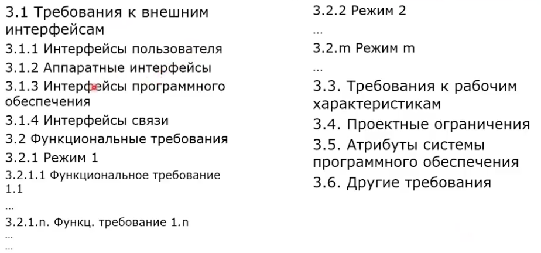
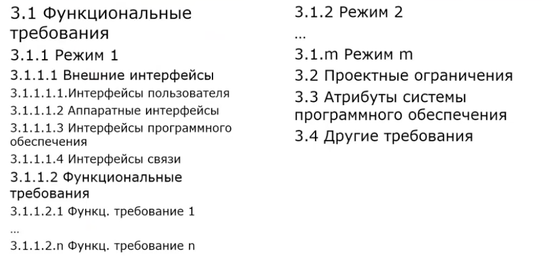
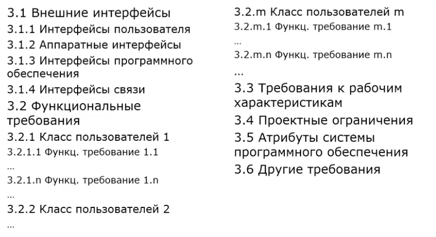
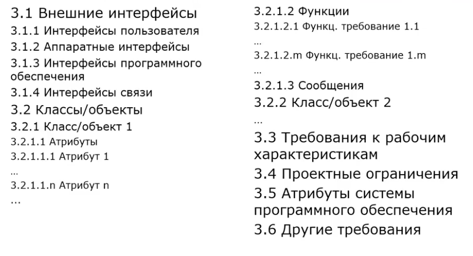
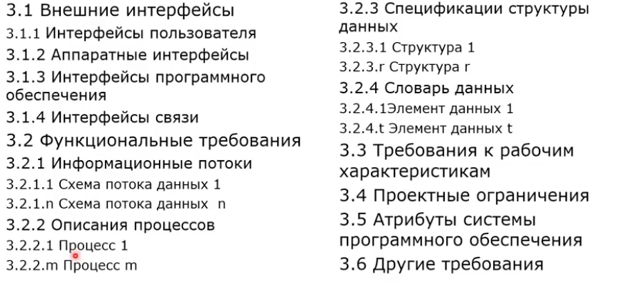
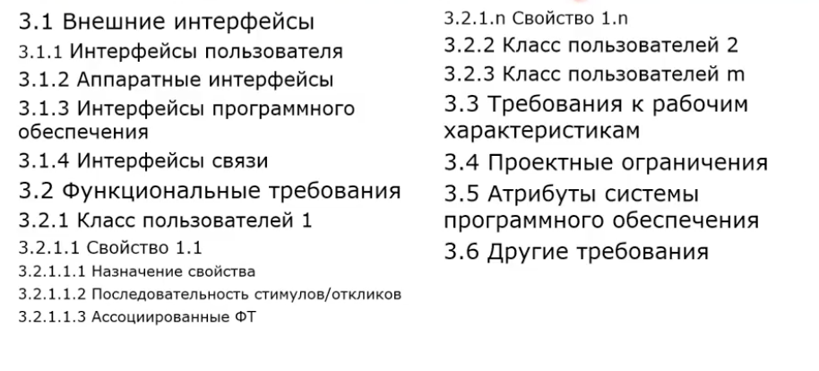

# Способы документирования требований

- документы на естественном документе
- графические модели
- формальные спецификации 

## Документы этапа разработки требований

- спецификация требований
- критерий принятия работ

### Спецификация требований
- фундамент всего последующего планирования, проектировани, реализации проекта
- основание для тестирования
основание для документирования
- должна содержать ограничения проекта
- НЕ должна содержать деталей проектирования, реализации тестирования и тд
- является исходным техническим соглашением между заказчиком и разработчиком

#### Шаблоны спецификация требований к ПО
- существуют различные стандарты
- наиболее распространенные в России
    - ГОСТ - 78 ЕСПД. ТЗ
    - ГОСТ - 89 Техническое задание на создание автоматизированной системы
    - ГОСТ - 2020 Техническое задание на создание автоматизированной системы
    - IEEE 830 - 1998 - Recommended Practice for Software Requirements Specification
    - ISO/IEC/IEEE 
- Шаблок не должен являться догмой
- следует модифицировать шаблон в соответствии с природой и потребностями проекта

#### ГОСТ-78. ЕСПД. Техническое задание

- введение
- основание для разработки 
- назначение разработки
- **требования к программе и программному изделию**
- **требования к программной документации**
- технико-экономические показатели
- стадии и этапы разработки
- порядок контроля и приемки 
- приложения 

#### ГОСТ-2020 ТЗ на создание автоматизированной системы

наши важные пункты:
- требования к автоматизированной системы (требования к функциям, требования к видам обеспечения, общие технические требования)

#### Шаблон спецификации требований (IEEE 830-1998). Общая часть

- введение 
- общее описание
- специфические требования (несколько шаблоной специфические требования)

#### По режимам v1

#### По режимам v2
- разные интерфейсы в зависимости от режима

#### По классам пользователей

#### По объектам

#### По свойствам 
- редко 

#### По функциональной иерархии

- потоковая модель приложения

#### Множественная организация

### Критерии принятия работ

- должны быть приняты всеми заинтересованными лицами
- четкие и недвусмысленные
- разделы методики принятия работ должны определяться количественными параметрами, а не качественными

#### Стандарты
-  ГОСТ-79 Программа и методика испытания. Требования к содержанию и оформлению

    - программа (состав и порядок)испытаний
    - методика испытаний
- Протокол испытаний (в конце)

